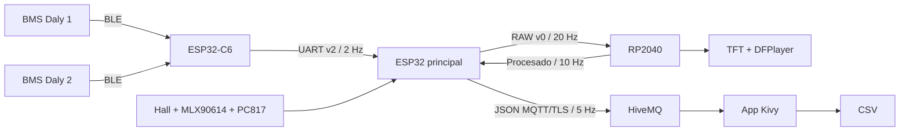

# Arquitectura y responsabilidades

## Flujo

## ESP32 principal

- Adquiere Hall, PC817 y temperaturas I2C.
- Recibe los dos BMS desde el ESP32-C6.
- Envía sensores RAW al RP2040 cada 50 ms.
- Recibe telemetría procesada y detecta timeout a los 500 ms.
- Mantiene Wi-Fi, NTP, TLS y MQTT en una tarea separada.
- Usa una cola de una muestra: una lectura nueva reemplaza la anterior.

## RP2040

- Valida COBS, cabecera, longitud y CRC.
- Acumula pulsos y filtra RPM.
- Calcula velocidad, estados y alarmas.
- Actualiza TFT y atiende DFPlayer.
- Responde aproximadamente a 10 Hz.

## ESP32-C6

- Mantiene dos conexiones BLE Daly.
- Consulta estado y 16 celdas por BMS.
- Calcula la edad de la última lectura válida.
- Envía una trama fija de 100 bytes cada 500 ms.
- No usa MQTT ni Wi-Fi.

## Aplicación

- Recibe JSON por MQTT/TLS.
- Valida campos y conserva compatibilidad con payloads anteriores.
- Marca datos recientes `<1 s`, retrasados `1–3 s` y vencidos `>=3 s`.
- Oculta y no graba datos vencidos.
- Exporta sesiones CSV mediante SAF en Android.

## Principio de diseño

El ESP32 sigue leyendo los sensores porque el hardware lo exige, pero delega
cálculos e interfaz local al RP2040. MQTT permanece en el ESP32 porque es el
gateway de red. El C6 se dedica exclusivamente a BLE/BMS. Así se evita que una
conexión lenta bloquee adquisición y no se duplican clientes MQTT.

